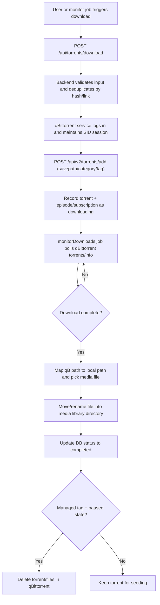

# yanl

# NAS Tools - Media Manager

A self-hosted media management tool for anime, TV shows, and movies.

## Architecture

- **Backend**: TypeScript + Bun + Hono + SQLite
- **Frontend**: TypeScript + Next.js + Tailwind CSS

## Setup

### Backend

```bash
cd backend
bun install
bun run dev
```

The backend will start on `http://localhost:3001` and print the API token to the console.

### Frontend

```bash
cd frontend
bun install
bun run dev
```

The frontend will start on `http://localhost:3000`.

On first visit, enter the API token from the backend console in the Settings page.

## Features

- **Media Search**: Search anime, TV shows, and movies via TMDB
- **Subscriptions**: Subscribe to media and track episodes
- **Torrent Search**: Search torrents from Mikan and DMHY RSS feeds
- **Download**: Send torrents to qBittorrent for download
- **Calendar**: View upcoming episodes on a calendar
- **File Management**: Automatically organize downloaded media into structured directories

## Configuration (Settings Page)

- **qBittorrent**: URL, username, password for your qBittorrent instance
- **TMDB Token**: API bearer token from themoviedb.org
- **AI**: OpenAI-compatible API config (for future intelligent parsing)
- **Media Directories**: Where to store anime, TV shows, and movies

## Workflow

1. Search for media using TMDB
2. Subscribe to a show/movie (creates folder structure)
3. Search for torrents via RSS feeds
4. Send selected torrents to qBittorrent
5. Downloaded files are organized into the configured media directories

## qBittorrent Workflow



Key backend pieces:
- `backend/src/services/qbittorrent.ts`: API session, add/pause/resume/delete, path mapping.
- `backend/src/services/monitor/downloads.ts`: RSS match and queue to qBittorrent.
- `backend/src/services/monitor/download-monitor.ts`: completion detection and file move.
- `backend/src/services/qbittorrent.ts`: managed-tag filtering, completion checks, and cleanup logic.

## Jellyseerr Sonarr Integration

NAS Tools now exposes a Sonarr-compatible API under `http://<backend-host>:3001/api/v3`.

Use these values when adding a Sonarr server in Jellyseerr:

- **Server URL**: `http://<backend-host>:3001`
- **API Key**: NAS Tools `api_token` (same token shown by backend and `/api/settings/token`)
- **Base URL**: leave empty unless you run NAS Tools behind a reverse proxy path

Supported Sonarr-compatible endpoints include system status, quality profiles, root folders, language profiles, tags, series lookup/list/add/update/delete, episodes, queue, and command triggers.
